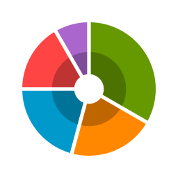

[comment]: <> ([![Build Status]&#40;https://www.travis-ci.com/mahozad/android-pie-chart.svg?branch=master&#41;]&#40;https://www.travis-ci.com/mahozad/android-pie-chart&#41;)

[comment]: <> (![Dependencies]&#40;https://img.shields.io/librariesio/github/mahozad/android-pie-chart&#41;)

[comment]: <> (![Code Size]&#40;https://img.shields.io/github/languages/code-size/mahozad/android-pie-chart&#41;)

[comment]: <> (![Repo Size]&#40;https://img.shields.io/github/repo-size/mahozad/android-pie-chart&#41;)

[comment]: <> (![SLOC]&#40;https://img.shields.io/tokei/lines/github/mahozad/android-pie-chart&#41;)

[comment]: <> (![Downloads]&#40;https://img.shields.io/github/downloads/mahozad/android-pie-chart/total&#41;)

[comment]: <> (![Closed Issues]&#40;https://img.shields.io/github/issues-closed/mahozad/android-pie-chart?color=green&#41;)

[comment]: <> (![Commits Since Last Release]&#40;https://img.shields.io/github/commits-since/mahozad/android-pie-chart/latest&#41;)


[](https://codecov.io/gh/mahozad/android-pie-chart)


<div align="center">



</div>

# NOTE: This library is still in initial phases of development

A Pie/Donut/Ring chart for Android.

### build.gradle[.kts]
```groovy
implementation("ir.mahozad.android:pie-chart:0.4.0")
```

### layout.xml
```xml
<ir.mahozad.android.PieChart
    android:id="@+id/pieChart"
    android:layout_width="wrap_content"
    android:layout_height="wrap_content"
    app:holeRatio="0.3"
    app:gap="8dp" />
```

### activity.kt
```kotlin
val pieChart = findViewById<PieChart>(R.id.pieChart)
pieChart.slices = listOf(
    PieChart.Slice(0.2f, Color.BLUE),
    PieChart.Slice(0.4f, Color.MAGENTA),
    PieChart.Slice(0.3f, Color.YELLOW),
    PieChart.Slice(0.1f, Color.CYAN),
)
```
